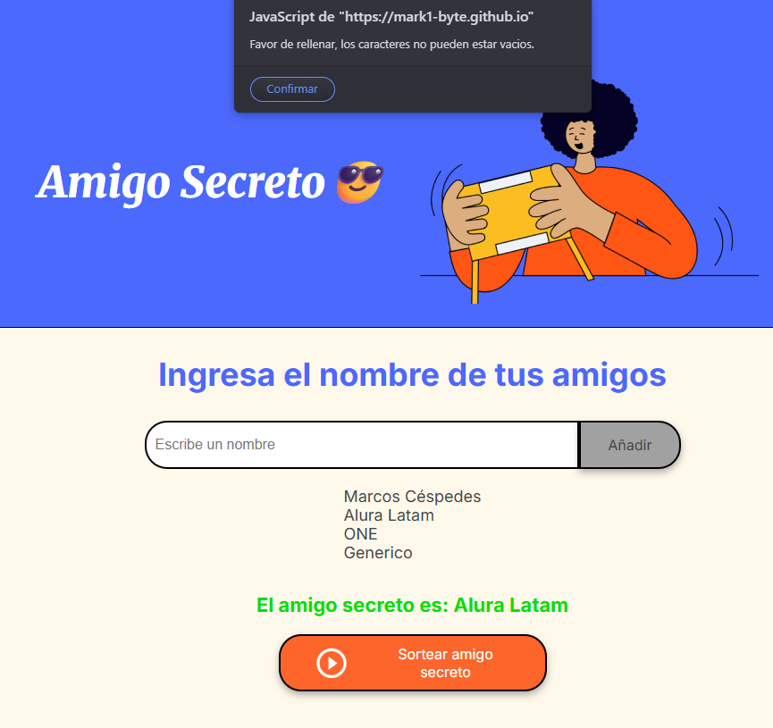

# Challenge Secret Santa/Desafío Amigo Secreto

Saludos! y Bienvenidos a mi solución del desafío del amigo secreto, favor de Leer este documento antes de ver el resto de archivos.

En este desafío trabajé con la creación de una lista dinámica de nombres y la lógica para sortear aleatoriamente un “amigo secreto”. Me gustó porque siento que fortalece conceptos y, al mismo tiempo, invita a investigar otras formas o códigos para realizar las mismas acciones.

Lo interesante es que muestra de manera sencilla cómo se combinan HTML y JavaScript para lograr una interacción real con el usuario. Es un ejemplo claro y práctico de cómo la programación puede transformar una página estática en una aplicación dinámica. Este tipo de ejercicios son un excelente punto de partida para aprender lógica de programación, validaciones, además de practicar con herramientas como Git, GitHub y HTML.

Sin más que decir, adjunto capturas de lo necesario

Captura de lista de amigos y sorteo aleatorio

Captura de error al ingresar input vacio

código desarrolado:

